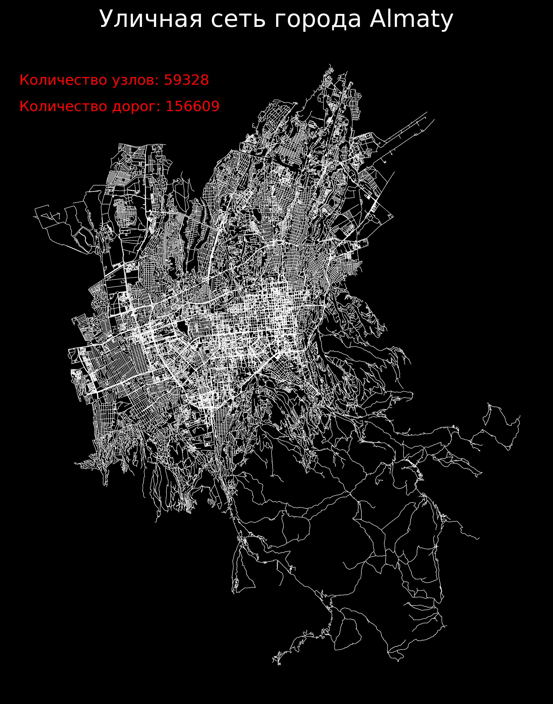
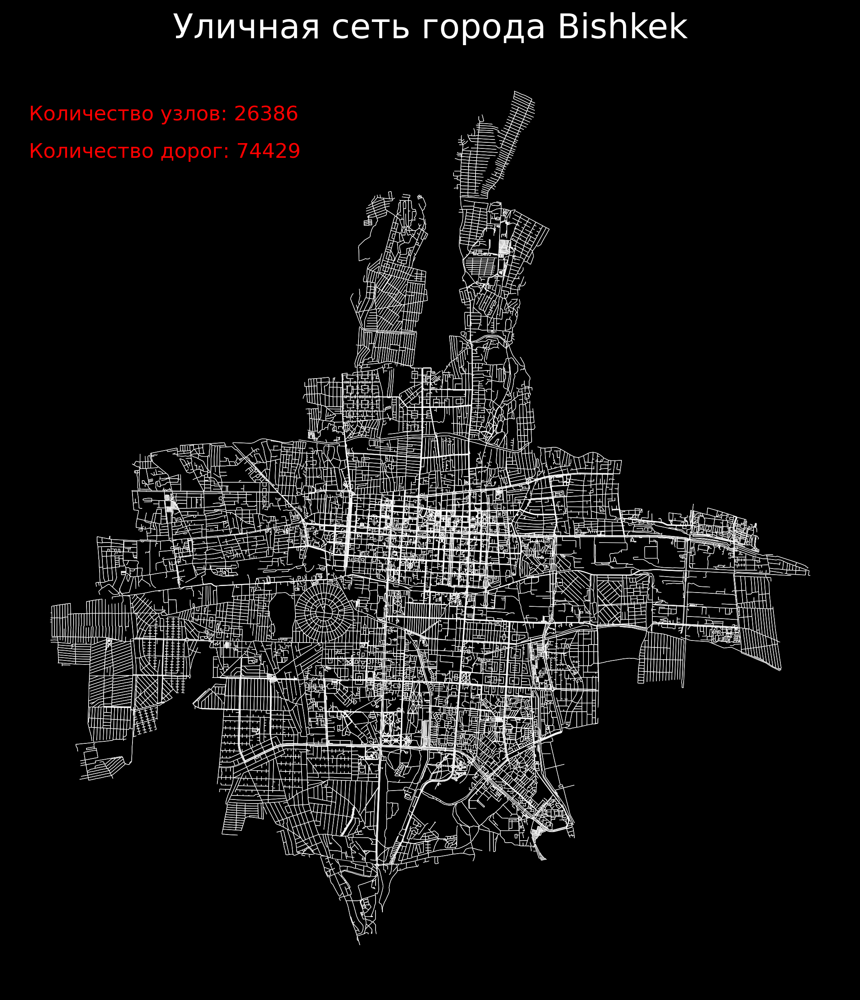
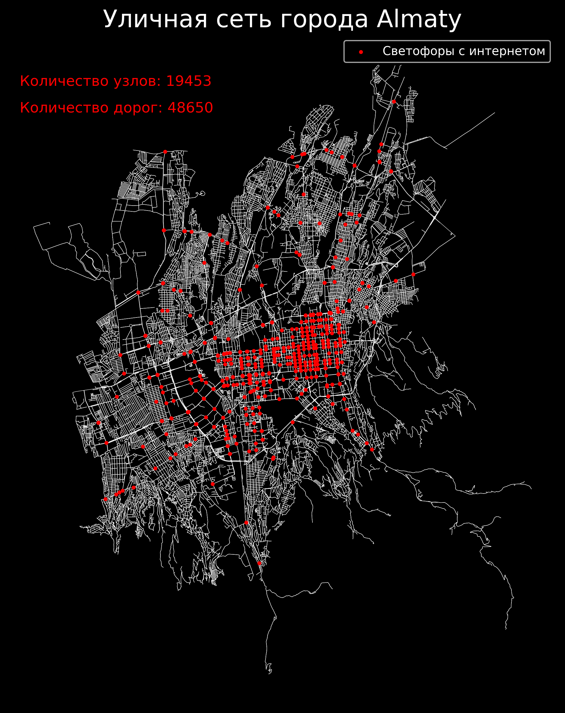

# Проект "Уличные данные"

Этот проект использует библиотеку OSMnx для извлечения и визуализации уличных данных городов.




| Название улицы            | Длина   | Начальные координаты            | Конечные координаты             |
|---------------------------|---------|---------------------------------|---------------------------------|
| проспект Алтынсарина     | 39.437  | (76.8759737, 43.2171505)        | (76.8756234, 43.2173967)        |
| Жандосов көшесі          | 70.046  | (76.8759737, 43.2171505)        | (76.8765424, 43.2176249)        |
| Сүлейменов көшесі        | 20.517  | (76.8759737, 43.2171505)        | (76.8761128, 43.2169966)        |
| Жандосов көшесі          | 170.106 | (76.8759737, 43.2171505)        | (76.8745249, 43.2160435)        |
| улица Айманова           | 10.64   | (76.8976055, 43.2311288)        | (76.897611, 43.2310332)         |
| Жандосов көшесі          | 13.0    | (76.8976055, 43.2311288)        | (76.8977465, 43.2311846)        |
| Жандосов көшесі          | 48.472  | (76.8976055, 43.2311288)        | (76.8970791, 43.2309216)        |
| Абай даңғылы             | 117.937 | (76.9151578, 43.2401507)        | (76.9166082, 43.2402431)        |
| Абай даңғылы             | 109.138 | (76.9166082, 43.2402431)        | (76.9179489, 43.2403402)        |
| Абылай хан даңғылы       | 15.957  | (76.943116, 43.2420444)         | (76.9430979, 43.2421873)        |
| Абай даңғылы             | 150.628 | (76.943116, 43.2420444)         | (76.9449669, 43.242175)         |
| Қабанбай батыр көшесі    | 17.207  | (76.942135, 43.2495286)         | (76.9423465, 43.2495432)        |
| Абылай хан даңғылы       | 14.575  | (76.942135, 43.2495286)         | (76.9421182, 43.2496591)        |
| Абылай хан даңғылы       | 10.689  | (76.942135, 43.2495286)         | (76.9421441, 43.2494327)        |

## Описание

Репозиторий содержит несколько скриптов на Python для работы с уличными данными:

- `street_data.py`: извлекает и сохраняет данные о улицах в CSV файл.
- `street_graph.py`: визуализирует уличную сеть города и сохраняет изображение.
- `street_traffic_signals.py`: визуализирует уличную сеть с отмеченными светофорами и сохраняет изображение.

## Использование

1. Убедитесь, что у вас установлены все зависимости, выполнив:
   ```
   pip install -r requirements.txt
   ```

2. Запустите нужный скрипт для работы с данными улиц вашего города:
   ```bash
   python street_data.py
   ```

3. Последуйте инструкциям в консоли для ввода названия города.

4. Результаты будут сохранены в указанных скриптом файлах или папках.

## Склонировать проект

Чтобы склонировать проект с GitHub, выполните следующую команду в терминале:

```bash
git clone https://github.com/marse11e/Street-Data-Project.git
```

## Вклад

Вы можете вносить свой вклад в проект, форкнув репозиторий и отправив pull request.

## Пример визуализации уличной сети


